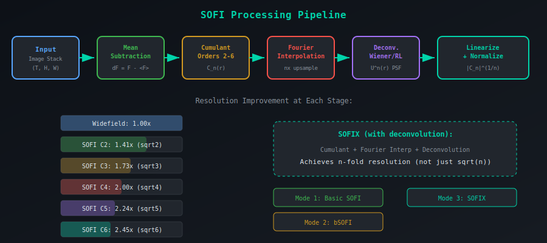
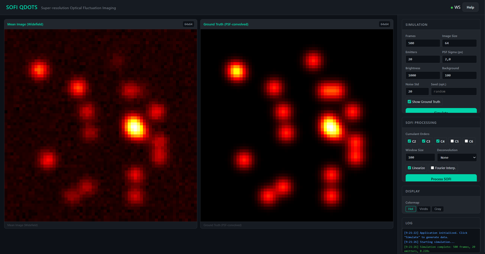
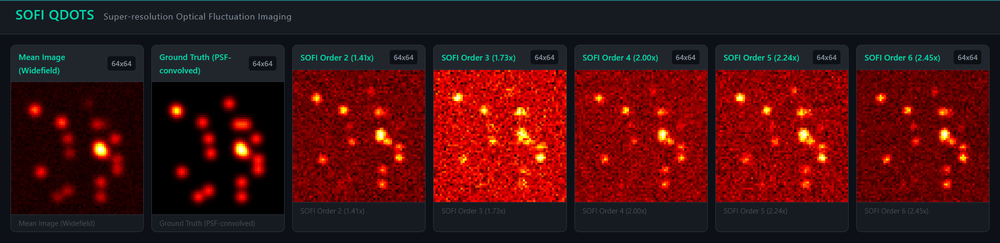
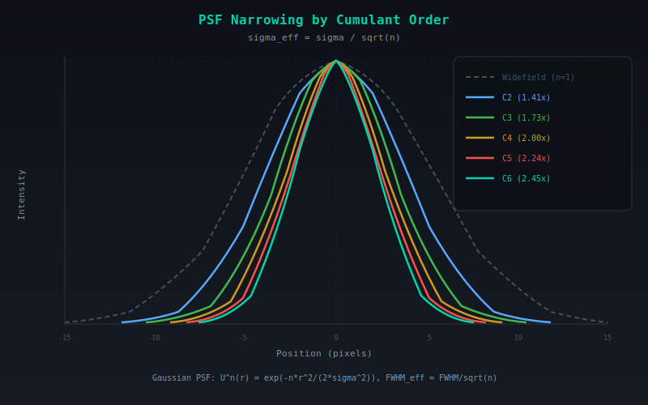
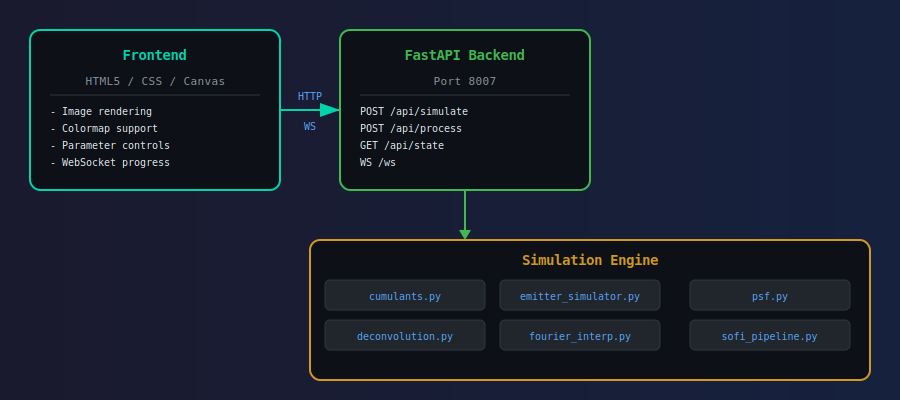

# FASL SOFI QDOTS -- Super-Resolution Optical Fluctuation Imaging

Super-resolution Optical Fluctuation Imaging (SOFI) extracts sub-diffraction spatial information from temporal fluorescence fluctuations of independently blinking quantum dot (QDot) emitters. Unlike single-molecule localization methods (PALM/STORM) that require extreme emitter sparsity, SOFI operates on dense labeling by exploiting higher-order statistical cumulants of intensity time traces.

The nth-order cumulant of the fluorescence signal narrows the effective point spread function (PSF) by a factor of sqrt(n), achieving super-resolution without hardware modifications. This web application provides a complete SOFI processing pipeline -- from synthetic QDot blinking simulation to cumulant computation, Fourier interpolation, and deconvolution -- all accessible through a browser-based interface.

---

## Motivation & Problem

Conventional microscopy is limited by diffraction to ~250nm resolution. SOFI breaks this limit by exploiting stochastic blinking of quantum dots — computing higher-order cumulants narrows the PSF by factor sqrt(n), achieving sub-diffraction resolution from standard widefield hardware.



---

## KPIs — Impact & Value

| KPI | Impact |
|-----|--------|
| Resolution breakthrough | Breaks 250nm diffraction limit → ~100nm (order 6) |
| Hardware simplicity | Standard widefield microscope — no PALM/STORM activation lasers |
| Speed vs PALM/STORM | ~1000 frames (SOFI) vs ~10000 frames (localization methods) |
| Single-frame mode | MSSR achieves ~1.5x from ONE frame (real-time capable) |

## SOFI Pipeline


---

## Frontend





---

## Technical Approach — Cumulant Super-Resolution

### Fluorescence Signal Model — Superposition of Blinking Emitters
The observed fluorescence at each pixel is the sum of all quantum dot contributions, each convolved with the microscope's diffraction-limited point spread function:

```
F(r, t) = Σ_k  ε_k · s_k(t) · U(r − r_k)
```

where **ε_k** is the molecular brightness of emitter k (photons/frame), **s_k(t) ∈ {0, 1}** is the stochastic on/off switching function (telegraph process driven by charge carrier trapping), **U(r)** is the point spread function (Gaussian approximation with width σ_PSF), and **r_k** is the true sub-pixel position of emitter k. Because U blurs each emitter over several pixels, nearby emitters overlap and cannot be resolved by conventional imaging.

### Cumulant Super-Resolution — PSF Narrowing by Statistical Analysis
The nth-order cumulant of the intensity time series isolates single-emitter contributions and narrows the effective PSF:

```
C_n(r) = Σ_k  ε_k^n · κ_n[s_k] · U^n(r − r_k)
```

The key insight: the PSF is raised to the nth power, narrowing the effective resolution:

```
σ_eff = σ_PSF / √n
```

where **κ_n[s_k]** is the nth cumulant of the blinking process (depends on on-time ratio ρ). Cross-terms between different emitters vanish because emitters fluctuate independently — this is a fundamental property of cumulants that moments do not share.



### Cumulant Formulas — Moment-to-Cumulant Partition Relations
For zero-mean fluctuations **δF = F − ⟨F⟩** with consecutive time lags, the cumulant is computed by subtracting all possible factorizations into lower-order moments:

| Order | Formula | Subtraction Terms |
|-------|---------|-------------------|
| 2 | `C2 = ⟨δF(t) · δF(t+1)⟩` | None (equals auto-covariance) |
| 3 | `C3 = ⟨δF(t) · δF(t+1) · δF(t+2)⟩` | None (equals 3rd central moment) |
| 4 | `C4 = M4 − M_{03}·M_{12} − M_{02}·M_{13} − M_{01}·M_{23}` | 3 pair-partition terms |
| 5 | `C5 = M5 − Σ_{10 (pair,triple)} M_pair · M_triple` | 10 partition terms |
| 6 | `C6 = M6 − 15·M4·M2 − 10·M3² + 30·M2³` | 40 partition terms |

The number of subtraction terms grows rapidly — the 6th-order cumulant requires removing 40 partition products to isolate the genuinely correlated 6-point statistics.

### Resolution Improvement Table

| Order | PSF Narrowing | Resolution Gain | Effective sigma |
|-------|--------------|-----------------|-----------------|
| 2 | U²(r) | 1.41x | σ / √2 |
| 3 | U³(r) | 1.73x | σ / √3 |
| 4 | U⁴(r) | 2.00x | σ / √4 |
| 5 | U⁵(r) | 2.24x | σ / √5 |
| 6 | U⁶(r) | 2.45x | σ / √6 |

### Processing Modes

| Mode | Pipeline | Resolution |
|------|----------|------------|
| Basic SOFI | Cumulant -> Linearize -> Normalize | √n-fold |
| bSOFI | Cumulant -> Linearize -> Cross-cumulant corrections | √n-fold, better SNR |
| SOFIX | Cumulant -> Fourier Interpolate -> Deconvolve -> Linearize | n-fold |

### QDot Blinking Model — Power-Law Fluorescence Intermittency
Quantum dots exhibit fluorescence intermittency where on- and off-durations follow heavy-tailed power-law distributions:

```
P(t_on)  ∝ t^(−α_on)      α_on  ≈ 1.5
P(t_off) ∝ t^(−α_off)     α_off ≈ 1.5
```

where **α ≈ 1.5** is the power-law exponent governing the probability of long dark or bright periods. Sampled via the inverse CDF method: **t = t_min · (1 − u)^(−1/(α − 1))** where **u ~ Uniform(0, 1)**. The heavy tail means occasional very long off-periods, which is why SOFI requires hundreds of frames to accumulate sufficient blinking statistics.

---

## Architecture



---

## Features

- **Cumulant computation** (orders 2--6) with correct moment-cumulant partition relations
- **Synthetic QDot simulator** with power-law blinking statistics and configurable noise
- **Fourier interpolation** for sub-pixel resolution enhancement (zero-padding upsampling)
- **Deconvolution** -- Wiener and Richardson-Lucy for SOFIX-level n-fold resolution
- **Linearization** -- nth-root correction for brightness nonlinearity (`|C_n|^(1/n)`)
- **Windowed processing** -- temporal windows for robustness against bleaching and drift
- **Web-based UI** with HTML5 Canvas rendering, colormap support, and real-time progress
- **WebSocket** streaming for live progress updates during computation
- **Swagger/ReDoc** auto-generated API documentation

## Project Metrics & Status

| Metric | Status |
|--------|--------|
| Tests | 38+ passing |
| Cumulant orders | 2-6 with verified partition formulas |
| MSSR | Order 1 and 2, single-frame and temporal |
| QDot simulator | Power-law blinking P(t) ∝ t^(−α) |
| File formats | TIFF stack import (tifffile + Pillow) |

---

## Quick Start

```bash
# Clone and enter the project
cd FASL_SOFI_QDOTS

# Create and activate virtual environment
python -m venv .venv
source .venv/Scripts/activate   # Windows
# source .venv/bin/activate     # Linux / macOS

# Install dependencies
pip install -r requirements.txt

# Launch the server
python -m uvicorn app.main:app --port 8007
```

Open **http://localhost:8007** in your browser. The interactive Swagger docs are at `/docs` and ReDoc at `/redoc`.

### Running Tests

```bash
# Individual test modules
python tests/test_cumulants.py
python tests/test_pipeline.py
python tests/test_emitter.py

# Or run all tests
python -m pytest tests/ -v
```

Tests include:
- Statistical validation of cumulant formulas against known distributions
- End-to-end pipeline execution with resolution verification
- Emitter blinking statistics (power-law exponent validation)

---

## Project Structure

```
FASL_SOFI_QDOTS/
├── app/
│   ├── __init__.py
│   ├── main.py                          # FastAPI app entry point (port 8007)
│   ├── api/
│   │   ├── __init__.py
│   │   └── routes.py                    # REST + WebSocket endpoints
│   ├── simulation/
│   │   ├── __init__.py
│   │   ├── cumulants.py                 # Core SOFI cumulant engine (orders 2-6)
│   │   ├── emitter_simulator.py         # QDot blinking simulator (power-law)
│   │   ├── psf.py                       # PSF models (Gaussian, Airy, effective)
│   │   ├── deconvolution.py             # Wiener + Richardson-Lucy deconvolution
│   │   ├── fourier_interpolation.py     # Sub-pixel Fourier upsampling
│   │   ├── mssr.py                      # Mean-Shift Super-Resolution processing
│   │   ├── tiff_loader.py              # TIFF microscopy image I/O
│   │   └── sofi_pipeline.py             # Pipeline orchestrator (3 processing modes)
│   └── static/
│       ├── index.html                   # Main frontend page
│       ├── css/
│       │   └── style.css                # Application styles
│       └── js/
│           ├── app.js                   # Frontend application logic
│           ├── renderer.js              # Canvas image rendering + colormaps
│           └── websocket.js             # WebSocket client for progress
├── tests/
│   ├── __init__.py
│   ├── test_cumulants.py                # Cumulant computation validation
│   ├── test_emitter.py                  # Blinking simulator tests
│   ├── test_mssr.py                     # MSSR processing tests
│   └── test_pipeline.py                 # End-to-end pipeline tests
├── docs/
│   ├── architecture.md                  # System design documentation
│   ├── sofi_theory.md                   # Exhaustive mathematical foundation
│   ├── development_history.md           # Project evolution log
│   ├── references.md                    # 20+ academic references
│   ├── png/
│   │   ├── frontend_base.png            # Frontend screenshot (base view)
│   │   └── frontend_outs.png            # Frontend screenshot (output view)
│   └── svg/
│       ├── architecture.svg             # System architecture diagram
│       ├── sofi_pipeline.svg            # Processing pipeline flowchart
│       ├── cumulant_orders.svg          # Cumulant order comparison
│       ├── cumulant_vs_moment.svg       # Cumulant vs moment diagram
│       └── sofi_vs_palm.svg             # SOFI vs PALM/STORM comparison
├── build.spec                           # PyInstaller spec file
├── Build_PyInstaller.ps1                # PowerShell build script
├── run_app.py                           # Uvicorn launcher with auto-browser
├── requirements.txt                     # Python dependencies
└── __init__.py
```

---

## API Documentation

### REST Endpoints

| Method | Path | Description |
|--------|------|-------------|
| `GET` | `/` | Serve the frontend application |
| `GET` | `/health` | Health check (`{"status": "ok", "version": "2.0.0"}`) |
| `GET` | `/docs` | Swagger UI (auto-generated) |
| `GET` | `/redoc` | ReDoc documentation |
| `POST` | `/api/simulate` | Generate synthetic blinking data |
| `POST` | `/api/process` | Run SOFI cumulant pipeline |
| `GET` | `/api/state` | Current application state |

### WebSocket

| Path | Description |
|------|-------------|
| `WS /ws` | Real-time progress updates (`{"type": "progress", "step": "...", "progress": 0.0-1.0}`) |

### Simulation Parameters (`POST /api/simulate`)

| Parameter | Type | Default | Range | Description |
|-----------|------|---------|-------|-------------|
| `num_frames` | int | 500 | 50--5000 | Number of time frames |
| `image_size` | int | 64 | 16--256 | Image size (square, pixels) |
| `num_emitters` | int | 20 | 1--200 | Number of QDot emitters |
| `psf_sigma` | float | 2.0 | 0.5--10.0 | PSF sigma (pixels) |
| `brightness` | float | 1000.0 | 100--10000 | Peak emitter brightness |
| `background` | float | 100.0 | 0--1000 | Background intensity |
| `noise_std` | float | 20.0 | 0--200 | Read noise standard deviation |
| `seed` | int | None | -- | Random seed for reproducibility |

### Processing Parameters (`POST /api/process`)

| Parameter | Type | Default | Description |
|-----------|------|---------|-------------|
| `orders` | list[int] | [2, 3, 4] | Cumulant orders to compute (2--6) |
| `window_size` | int | 100 | Temporal window for cumulant accumulation |
| `use_fourier` | bool | false | Enable Fourier interpolation upsampling |
| `deconvolution` | str | "none" | Method: "none", "wiener", "richardson_lucy" |
| `linearize` | bool | true | Apply nth-root brightness linearization |
| `psf_sigma` | float | 2.0 | PSF sigma for deconvolution kernel |

### Pipeline Class (`SOFIPipeline`)

```python
from app.simulation.sofi_pipeline import SOFIPipeline

pipeline = SOFIPipeline(
    orders=[2, 3, 4],
    psf_sigma=2.0,
    use_fourier=True,
    deconvolution="wiener",
)
result = pipeline.process(image_stack)

# result.mean_image           -- widefield equivalent
# result.cumulant_images[n]   -- raw cumulant for order n
# result.sofi_images[n]       -- final SOFI super-resolution image
# result.interpolated_images  -- Fourier-interpolated intermediates
# result.deconvolved_images   -- deconvolution intermediates
```

---

## Port

**8007** -- http://localhost:8007

---

## Documentation

- [User Guide](docs/user_guide.md) -- Operator-focused walkthrough, recipes, troubleshooting
- [SOFI Theory](docs/sofi_theory.md) -- Exhaustive mathematical foundation with derivations
- [System Architecture](docs/architecture.md) -- Component design and data flow
- [Development History](docs/development_history.md) -- Project evolution and decisions
- [References](docs/references.md) -- 20+ academic references (Dertinger, Geissbuehler, Basak, etc.)

### Domain diagrams

- [Optical setup](docs/svg/optical_setup.svg) -- Widefield 532 nm / NA 1.4 / sCMOS layout with physical scales
- [Fluctuation analysis](docs/svg/fluctuation_analysis.svg) -- From blinking trace to lagged products to cumulant map

## Tech Stack

- **Python 3.12+** -- Runtime
- **FastAPI 0.135+** -- ASGI web framework with auto-generated OpenAPI docs
- **NumPy 2.4+** -- Array computation and cumulant math
- **SciPy 1.17+** -- FFT for Fourier interpolation and deconvolution
- **Pydantic 2.12+** -- Request/response validation
- **Uvicorn 0.42+** -- ASGI server
- **tifffile** -- TIFF image I/O for microscopy data
- **HTML5 Canvas** -- Frontend image rendering with colormaps
- **WebSocket** -- Real-time progress streaming

---

## References

1. Dertinger, T. et al. (2009). Fast, background-free, 3D super-resolution optical fluctuation imaging (SOFI). *PNAS*, 106(52):22287-22292.
2. Geissbuehler, S. et al. (2012). Mapping molecular statistics with balanced SOFI (bSOFI). *Optical Nanoscopy*, 1:4.
3. Dertinger, T. et al. (2010). Achieving increased resolution with SOFI. *Optics Express*, 18(18):18875-18885.
4. Basak, R. et al. (2025). Super-resolution imaging of quantum dots. *Nature Photonics*, 19:229-237.
5. Kuno, M. et al. (2001). Fluorescence intermittency in single InP quantum dots. *JCP*, 115:1028.
6. Richardson, W.H. (1972). Bayesian-Based Iterative Method of Image Restoration. *JOSA*, 62(1):55-59.
7. Lucy, L.B. (1974). An iterative technique for the rectification of observed distributions. *AJ*, 79:745-754.

---

## License

Academic / Research use.
